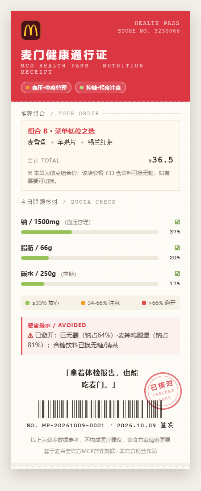

# 🍟 麦门健康通行证 (McD Health Pass)

> **拿着体检报告吃麦当劳。**

别人告诉你这个套餐多少卡——我们告诉你，这份套餐对**你这个身体状况的人**意味着什么。

<p align="center">
  
</p>

[](https://github.com/AZmanblaze/mcd-health-pass/stargazers)

## 这是什么

一个基于麦当劳官方 MCP 的健康点餐助手。把你的体检报告交给它，它会：

1. **读懂报告**：提取血压、血糖、血脂、尿酸等异常指标，映射为健康状况档案（高血压/血脂异常/控糖/减脂等），你确认后本地保存
2. **翻译菜单**：基于麦当劳官方营养数据，计算每个单品「**占你每日限额的百分比**」——巨无霸含钠 961mg，对普通人是一顿饭，对高血压管理人群是日限额的 64%。菜单页面上看不到这件事，我们把它做成三色分级：🟢 放心选 / 🟡 注意搭配 / 🔴 本餐不建议
3. **组合推荐**：生成 2-3 个套餐组合，逐营养素标注限额占用；控糖用户自动识别含糖饮料并给出无糖替换建议
4. **到店下单**：查附近门店 → 确认在售 → 自动匹配优惠券算价 → 确认后下单（v1 支持到店自取）
5. **生成通行证**：一张可分享的「麦门健康通行证」卡片——你的健康标签 + 今日推荐 + 限额占用图

## 它的边界（先说清楚）

- **只做事实映射，不做医疗建议。** 我们告诉你"这份套餐钠占你日限额 58%"，不告诉你"你能不能吃"。饮食方案请遵医嘱。
- 营养限额数字全部来自《中国居民膳食指南(2022)》与国家卫健委慢病食养指南，规则库逐条注明来源，拒绝拍脑袋。
- 麦当劳官方营养数据不含嘌呤/过敏原，因此痛风仅做定性提示（规则库中已标注），过敏场景不覆盖。
- 诚实地说：麦当劳菜单上"健康套餐"常常不存在。我们的价值是**排序和限额管理**——让你在真实菜单里选到相对最优解，而不是假装薯条是蔬菜。

## 安装

### 前置条件

- 麦当劳中国 MCP Token：登录 [open.mcd.cn/mcp](https://open.mcd.cn/mcp) → 控制台 → 激活
- 任意支持 Streamable HTTP 的 MCP 客户端（本项目在 [WorkBuddy](https://www.workbuddy.cn) 中开发与使用）

### 配置 MCP

在客户端的 MCP 配置中添加（替换 Token）：

```json
{
  "mcpServers": {
    "mcd-mcp": {
      "type": "streamablehttp",
      "url": "https://mcp.mcd.cn",
      "headers": {
        "Authorization": "Bearer YOUR_MCP_TOKEN"
      }
    }
  }
}
```

### 安装 Skill

将 `skill/SKILL.md` 与 `rules/health_rules.yaml` 安装到你的 MCP 客户端技能目录（WorkBuddy 用户放到 `~/.workbuddy/skills/mcd-health-pass/`）。

## 使用示例

```
你：[贴上体检报告截图]
它：从你的报告提取到：
    - 高血压（收缩压 148）→ 中度管理
    - 空腹血糖 6.4 → 控糖（轻度注意）
    确认建档？

你：确认。今晚想吃麦当劳
它：📋 为你的「高血压·中度 + 控糖·轻度」档案推荐：
    | 组合 | 钠/限额 | 脂肪/限额 | 碳水/限额 |
    | 麦香鱼+苹果片+红茶   | 🟢 37% | 🟢 20% | 🟢 15% |
    | 板烧鸡腿堡+玉米杯+无糖可乐 | 🟡 52% | 🟢 24% | 🟢 18% |
    你家附近的 XX 门店两家组合都在售，要算价吗？

你：生成通行证
它：[麦门健康通行证卡片]
```

## 目标用户

- 拿着"血压偏高/血糖临界"体检报告、依然想去麦当劳的人
- 帮父母点餐、需要考虑他们慢病忌口的子女
- 控糖控脂但不想戒掉麦门的老饕

## 项目结构

```
mcd-health-pass/
├── README.md               # 本文件
├── CONTEST_DECLARATION.md  # 参赛声明（官方原样）
├── MCP_INTEGRATION.md      # MCP 工具与调用链说明
├── skill/SKILL.md          # Skill 主体（提示词工作流）
├── rules/health_rules.yaml # 慢病限额规则库（含来源注释）
├── assets/                 # 分享卡片模板（票据收据风）
├── examples/               # 仿真体检报告 + 健康档案样例
└── design-demos/           # 设计方向探索记录（三方向初稿）
```

## Roadmap

- [x] v1.0：报告建档 + 限额推荐 + 到店自取下单 + 分享卡片
- [ ] v1.1：麦乐送外送支持（地址管理 + 配送费）
- [ ] v1.2：多用户家庭档案（给爸妈分别建档）
- [ ] v1.3：当日累计限额（早上的汉堡算进晚餐的额度）

## 参考来源

- 《中国居民膳食指南（2022）》中国营养学会
- 《中国高血压防治指南（2024年修订版）》
- 《中国2型糖尿病防治指南（2020年版）》
- 国家卫健委《成人高血压食养指南（2023年版）》等系列食养指南

## License

MIT。麦当劳、巨无霸及麦门是麦当劳公司的商标，本项目为非官方粉丝作品，与麦当劳公司无关联。
